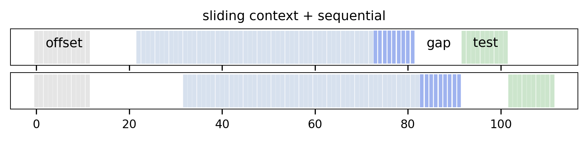
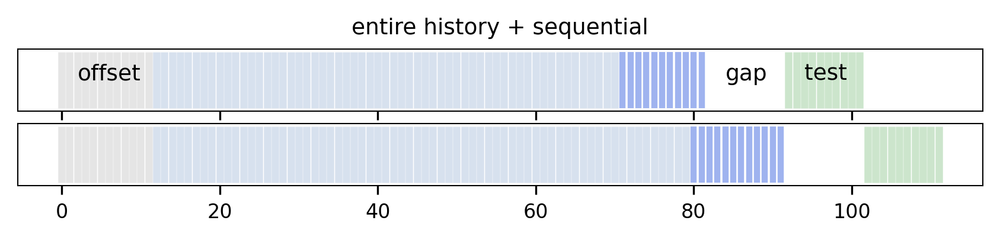
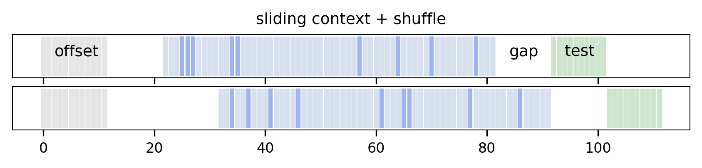
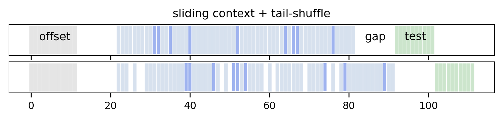
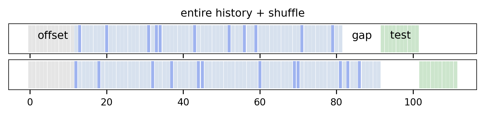
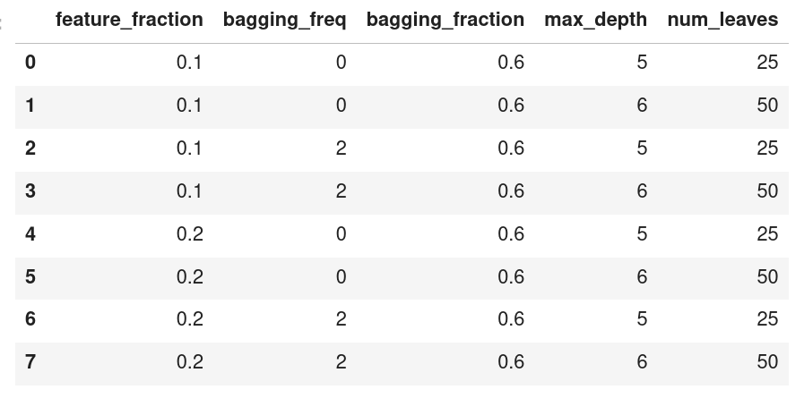

### What?
A bunch of utils, piled into a single repo for ease of access

1. [**SlidingWindowCV**](#slidingwindowcv)
2. [**ParamGridIter**](#paramgriditer)

### Why?
scikit-learn model selection utils are not flexible enough

---

### Overview

### SlidingWindowCV

<details>
    <summary>setup</summary>
    
    ```
    from utils.crossval import SlidingWindowCV
    from utils.utils import plot_cv_splits
    import matplotlib.pyplot as plt

    offset = 12

    plt.style.use('default')
    plt.rcParams.update({'font.size': 8, 
                         'axes.linewidth': 0.5})
    ```
</details>

```python
cv = SlidingWindowCV(start=80, 
                     test_size=10,
                     train_size=60,
                     eval_size=0.15, 
                     gap=10, 
                     eval_mode='sequential')
plot_cv_splits(cv, offset, 100, 'sliding context + sequential', (7,1))
```


```python
cv = SlidingWindowCV(start=80,
                     test_size=10,
                     train_size=-1,
                     eval_size=0.15,
                     gap=10,
                     eval_mode='sequential')
plot_cv_splits(cv, offset, 100, 'entire history + sequential', (7,1))
```


```python
cv = SlidingWindowCV(start=80,
                     test_size=10,
                     train_size=60,
                     eval_size=0.15,
                     gap=10,
                     eval_mode='shuffle')
plot_cv_splits(cv, offset, 100, 'sliding context + shuffle', (7,1))
```


```python
cv = SlidingWindowCV(start=80, 
                     test_size=10, 
                     train_size=60, 
                     eval_size=0.15, 
                     gap=10, 
                     eval_mode='tail-shuffle')
plot_cv_splits(cv, offset, 100, 'sliding context + tail-shuffle', (7,1))
```


```python
cv = SlidingWindowCV(start=80, 
                     test_size=10,
                     train_size=-1,
                     eval_size=0.15, 
                     gap=10, 
                     eval_mode='shuffle')
plot_cv_splits(cv, offset, 100, 'entire history + shuffle', (7,1))
```


### Usage

```python
cv = SlidingWindowCV(start=80,
                     test_size=10,
                     train_size=60,
                     eval_size=0.15,
                     gap=10,
                     eval_mode='shuffle')

X = np.arange(100)[:,None]
y = np.arange(100)

for ( i_repeat,
      i_split,
      _,
      ix_test_,
      ix_train_,
      ix_eval_  ) in cv.split(X, y):
    
    X_train, y_train = X[ix_train_], y[ix_train_]
    X_eval,  y_eval  = X[ix_eval_],  y[ix_eval_]
    X_test,  y_test  = X[ix_test_],  y[ix_test_]
```

---

### ParamGridIter

```python
from utils.crossval import ParamGridIter

param_grid = {
      'data_sample_strategy': ['bagging'],
      'objective':            ['mae'],
      'boosting':             ['gbdt'],
      'feature_fraction':     [0.1, 0.2],
      'learning_rate':        [0.01],
      'n_estimators':         [20000],
      'n_early_stop_rounds/min_delta': [[300, 1e-3]],
      'bagging_freq/bagging_fraction': [[0, 0.6], [2, 0.6]],  
      'max_depth/num_leaves':          [[5, 25], [6, 50]],
     
}
pg = ParamGridIter(param_grid)

pg.to_dataframe(drop_const=True)
```


### Usage

```python
from sklearn.model_selection import RepeatedKFold
import lightgbm as lgb

X = np.arange(100)[:,None]
y = np.arange(100)

cv = RepeatedKFold(n_splits=6, n_repeats=3)

for (i_rep, (ix_train, ix_test)), \
    (i_param, params) in zip(enumerate(cv.split(X, y)),
                             enumerate(pg)):
    
    X_train, y_train = X[ix_train], y[ix_train]
    X_test, y_test = X[ix_test], y[ix_test]
    
    model = lgb.LGBMRegressor(**params).fit(X_train, y_train)
    # ...
```